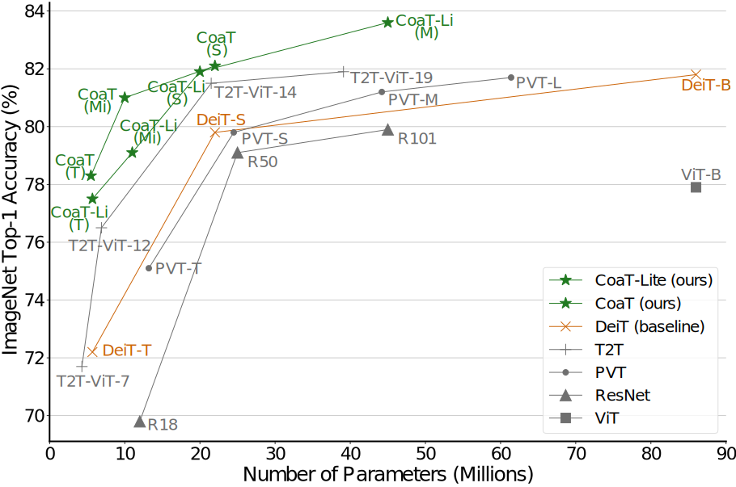

# CoaT: Co-Scale Conv-Attentional Image Transformers

## Introduction
This repository contains the official code and pretrained models for [CoaT: Co-Scale Conv-Attentional Image Transformers](http://arxiv.org/abs/2104.06399). It introduces (1) a co-scale mechanism to realize fine-to-coarse, coarse-to-fine and cross-scale attention modeling and (2) an efficient conv-attention module to realize relative position encoding in the factorized attention.



For more details, please refer to [CoaT: Co-Scale Conv-Attentional Image Transformers](http://arxiv.org/abs/2104.06399) by [Weijian Xu*](https://weijianxu.com/), [Yifan Xu*](https://yfxu.com/), [Tyler Chang](https://tylerachang.github.io/), and [Zhuowen Tu](https://pages.ucsd.edu/~ztu/).

## Performance
1. Classification (ImageNet dataset)

| Name | Acc@1 | Acc@5 | #Params |
| --- | --- | --- | --- |
| CoaT-Lite Tiny | 77.5 | 93.8 | 5.7M |
| CoaT-Lite Mini | 79.1 | 94.5 | 11M |

2. Instance Segmentation (Mask R-CNN w/ FPN on COCO dataset)

| Name | Schedule | Bbox AP | Segm AP |
| --- | --- | --- | --- |
| CoaT-Lite Mini | 1x | 39.9 | 36.4 |
| CoaT-Lite Mini | 3x | 41.8 | 37.7 |

## Changelog
04/25/2021: Code and pre-trained checkpoint for Mask R-CNN benchmark with CoaT-Lite Mini backbone is released. <br />
04/23/2021: Pre-trained checkpoint for CoaT-Lite Mini is released. <br />
04/22/2021: Code and pre-trained checkpoint for CoaT-Lite Tiny are released.

## Usage
The following usage is provided for the classification task using CoaT model. For the other tasks, please follow the corresponding readme, such as [instance segmentation](./tasks/detectron2/README.md).

### Environment Preparation
1. Set up a new conda environment and activate it.
   ```bash
   # Create an environment with Python 3.8.
   conda create -n coat python==3.8
   conda activate coat
   ```

2. Install required packages.
   ```bash
   # Install PyTorch 1.7.1 w/ CUDA 11.0.
   pip install torch==1.7.1+cu110 torchvision==0.8.2+cu110 torchaudio==0.7.2 -f https://download.pytorch.org/whl/torch_stable.html

   # Install timm 0.3.2.
   pip install timm==0.3.2

   # Install einops.
   pip install einops
   ```

### Code and Dataset Preparation
1. Clone the repo.
   ```bash
   git clone https://github.com/mlpc-ucsd/CoaT
   cd CoaT
   ```

2. Download ImageNet dataset (ILSVRC 2012) and extract.
   ```bash
   # Create dataset folder.
   mkdir -p ./data/ImageNet

   # Download the dataset (not shown here) and copy the files (assume the download path is in $DATASET_PATH).
   cp $DATASET_PATH/ILSVRC2012_img_train.tar $DATASET_PATH/ILSVRC2012_img_val.tar $DATASET_PATH/ILSVRC2012_devkit_t12.tar.gz ./data/ImageNet

   # Extract the dataset.
   python -c "from torchvision.datasets import ImageNet; ImageNet('./data/ImageNet', split='train')"
   python -c "from torchvision.datasets import ImageNet; ImageNet('./data/ImageNet', split='val')"
   # After the extraction, you should observe `train` and `val` folders under ./data/ImageNet.
   ```

### Evaluate Pre-trained Checkpoint

We provide the CoaT checkpoints pre-trained on the ImageNet dataset.

| Name | Acc@1 | Acc@5 | #Params | SHA-256 (first 8 chars) | URL |
| --- | --- | --- | --- | --- | --- |
| CoaT-Lite Tiny | 77.5 | 93.8 | 5.7M | e88e96b0 |[model](https://vcl.ucsd.edu/coat/pretrained/coat_lite_tiny_e88e96b0.pth), [log](https://vcl.ucsd.edu/coat/pretrained/coat_lite_tiny_e88e96b0.txt) |
| CoaT-Lite Mini | 79.1 | 94.5 | 11M | 6b4a8ae5 |[model](https://vcl.ucsd.edu/coat/pretrained/coat_lite_mini_6b4a8ae5.pth), [log](https://vcl.ucsd.edu/coat/pretrained/coat_lite_mini_6b4a8ae5.txt) |

The following commands provide an example (CoaT-Lite Tiny) to evaluate the pre-trained checkpoint.
   ```bash
   # Download the pretrained checkpoint.
   mkdir -p ./output/pretrained
   wget http://vcl.ucsd.edu/coat/pretrained/coat_lite_tiny_e88e96b0.pth -P ./output/pretrained
   sha256sum ./output/pretrained/coat_lite_tiny_e88e96b0.pth  # Make sure it matches the SHA-256 hash (first 8 characters) in the table.

   # Evaluate.
   # Usage: bash ./scripts/eval.sh [model name] [output folder] [checkpoint path]
   bash ./scripts/eval.sh coat_lite_tiny coat_lite_tiny_pretrained ./output/pretrained/coat_lite_tiny_e88e96b0.pth
   # It should output results similar to "Acc@1 77.504 Acc@5 93.814" at very last.
   ```
   
### Train
   The following commands provide an example (CoaT-Lite Tiny, 8-GPU) to train the CoaT model.
   ```bash
   # Usage: bash ./scripts/train.sh [model name] [output folder]
   bash ./scripts/train.sh coat_lite_tiny coat_lite_tiny
   ```

### Evaluate
   The following commands provide an example (CoaT-Lite Tiny) to evaluate the checkpoint after training.
   ```bash
   # Usage: bash ./scripts/eval.sh [model name] [output folder] [checkpoint path]
   bash ./scripts/eval.sh coat_lite_tiny coat_lite_tiny_eval ./output/coat_lite_tiny/checkpoints/checkpoint0299.pth
   ```

## Citation
```
@misc{xu2021coscale,
      title={Co-Scale Conv-Attentional Image Transformers}, 
      author={Weijian Xu and Yifan Xu and Tyler Chang and Zhuowen Tu},
      year={2021},
      eprint={2104.06399},
      archivePrefix={arXiv},
      primaryClass={cs.CV}
}
```

## License
This repository is released under the Apache License 2.0. License can be found in [LICENSE](LICENSE) file.

## Acknowledgment
Thanks to [DeiT](https://github.com/facebookresearch/deit) and [pytorch-image-models](https://github.com/rwightman/pytorch-image-models) for a clear and data-efficient implementation of [ViT](https://openreview.net/forum?id=YicbFdNTTy). Thanks to [lucidrains' implementation](https://github.com/lucidrains/lambda-networks) of [Lambda Networks](https://openreview.net/forum?id=xTJEN-ggl1b) and [CPVT](https://github.com/Meituan-AutoML/CPVT).